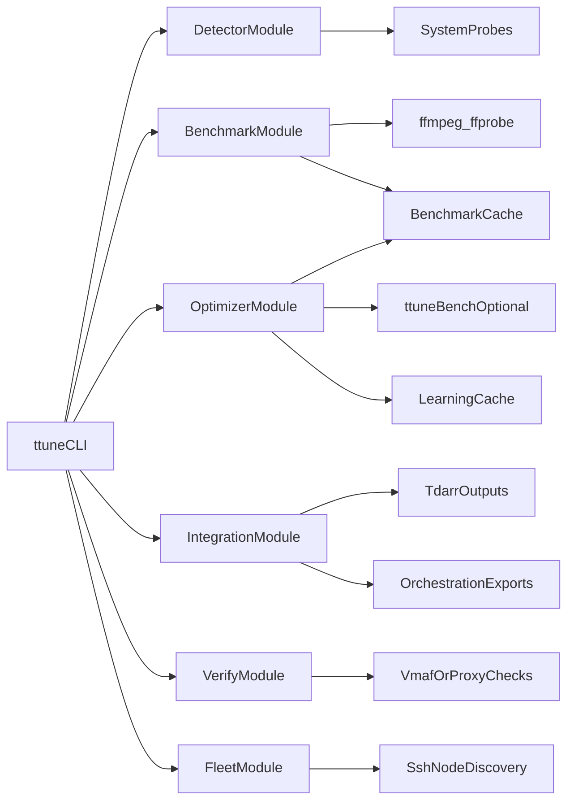

# Architecture

## Modules

- `lib/detect.sh`: CPU/GPU/encoder probing + fingerprints
- `lib/benchmark.sh`: sample clip benchmark + cache
- `lib/optimize.sh`: recommendations, VMAF search fallback path, content profile, learning cache
- `lib/generate.sh`: Tdarr outputs, flow/plugin templates, k8s/docker/unmanic/CI artifacts
- `lib/verify.sh`: quality gate output (`--ci`)
- `lib/fleet.sh`: node profile aggregation and label output
